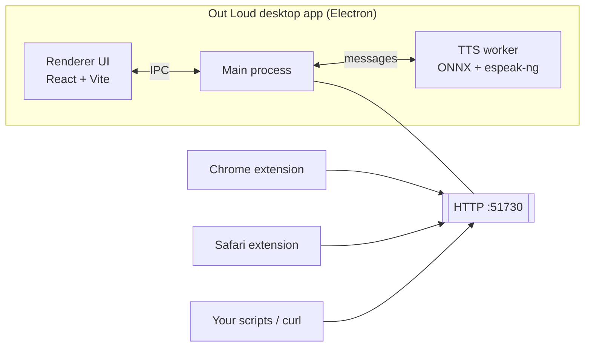

<p align="center">
  
</p>

<h1 align="center">Out Loud</h1>

<p align="center">
  <b>Free, open-source, 100% offline AI text-to-speech.</b>
</p>

<p align="center">
  A native desktop app for macOS, Windows, and Linux that reads text aloud with natural-sounding voices.<br/>
  Everything runs locally on your machine. No cloud, no accounts — your text never leaves your computer.
</p>

<p align="center">
  <a href="./LICENSE"></a>
  <a href="#install"></a>
</p>

<p align="center">
  <a href="https://buymeacoffee.com/julia_hk"></a>
</p>

<p align="center">
  
</p>

---

## Contents

- [What it does](#what-it-does)
- [Screenshots](#screenshots)
- [Install](#install)
  - [macOS first launch](#macos-first-launch)
  - [Windows: SmartScreen warning](#windows-smartscreen-warning)
- [Supported languages](#supported-languages)
- [Speaking tips: pauses & shortcuts](#speaking-tips-pauses--shortcuts)
- [How it works](#how-it-works)
- [API](#api)
- [Repository layout](#repository-layout)
- [Build from source](#build-from-source)
- [Scripts](#scripts)
- [Documentation](#documentation)
- [Contributing](#contributing)
- [Support](#support)
- [License](#license)
- [Credits](#credits)

## What it does

- Reads text aloud with 50+ natural voices across 8 languages
- Speech runs 100% offline — your text never leaves your computer
- Built on [Kokoro-82M](https://huggingface.co/hexgrad/Kokoro-82M), an open-weight TTS model ranked highly on the [TTS Arena](https://huggingface.co/spaces/TTS-AGI/TTS-Arena)
- Accessible **Talker mode** (type-and-speak) and inline **pause tags** — see [Speaking tips](#speaking-tips-pauses--shortcuts)
- Desktop app with menu-bar / system-tray integration
- Tells you in-app when a new version is available (checks GitHub releases)
- Sends anonymous, content-free usage stats (which features get used — never your text, files, or document titles) to guide what we build next
- Chrome & Safari extensions to read any webpage in one click
- Local HTTP API on port `51730` for extensions and scripts

## Screenshots

<table>
  <tr>
    <td align="center">
      <br/>
      <sub><b>Desktop app.</b> Paste, pick a voice, hit play.</sub>
    </td>
    <td align="center">
      <br/>
      <sub><b>System tray.</b> Menu-bar access while you work.</sub>
    </td>
  </tr>
</table>

## Install

Grab the latest release for your platform from the [Releases page](https://github.com/light-cloud-com/out-loud/releases/latest):

- **macOS**: `Out Loud-<version>.dmg` (Apple Silicon & Intel)
- **Windows**: `Out Loud-<version>.exe`
- **Linux**: `Out Loud-<version>.AppImage`

Or build it yourself. See [Build from source](#build-from-source).

### macOS first launch

**1.0.3 and newer**: the app is Developer-ID signed and Apple-notarized. Double-click — it opens. No dialog.

**1.0.2 only**: that one release shipped signed but un-notarized (Apple's notary service was stuck during the release window). On first launch you'll see _"macOS cannot verify the developer of Out Loud"_. Upgrade to 1.0.3+ to skip this entirely, or work around it once:

- **macOS 15 (Sequoia)+**: click **Done** → open **System Settings → Privacy & Security** → scroll to the Security section → click **Open Anyway** next to the "Out Loud was blocked" line → authenticate.
- **macOS 14 (Sonoma) and older**: **right-click** Out Loud in `/Applications` → **Open** → click **Open** in the dialog.

Either way macOS remembers your decision — future launches are direct.

(If you see **"Out Loud.app is damaged and can't be opened"** instead, the download likely got corrupted — re-download. Last-resort workaround: `xattr -dr com.apple.quarantine "/Applications/Out Loud.app"`.)

### Windows: SmartScreen warning

Windows may show "Windows protected your PC" because the installer isn't signed with a paid Windows code-signing cert. Click **More info** → **Run anyway** to proceed.

## Supported languages

English (US & UK), Japanese, Chinese (Mandarin), Spanish, Brazilian Portuguese, Italian, and Hindi. 50+ voices total.

## Speaking tips: pauses & shortcuts

**Pauses.** Insert a silence anywhere in the text with a tag — all of these are equivalent and produce a 1-second pause:

```
[1s]        [1000ms]        <pause=1s>        <break time="1s"/>
```

Use decimals or `ms` for finer control (`[0.5s]`, `[250ms]`). Punctuation also pauses automatically, so normal prose already sounds natural: period/semicolon ≈ 0.4s, colon ≈ 0.3s, comma ≈ 0.2s, and a line break ≈ 0.4s.

**Keyboard.**

- **⌘/Ctrl + Enter** — speak the current text (works any time).
- **Shift + Enter** — insert a line break without speaking.
- **Esc** — jump the cursor back to the text box.
- **Talker mode** (Settings): plain **Enter** speaks and then clears the box, and the text box stays editable while audio plays — type-and-go, no need to find a button.

**Blend voices (API).** The `voice` field accepts mixing formulas, e.g. `af_heart*0.6+am_michael*0.4` (weights must sum to 1) — see [API](#api).

## How it works

The Electron app owns the ONNX model, runs TTS in a worker thread, and exposes a local HTTP API on port `51730` that the browser extensions talk to. Nothing goes to the network.



## API

The Electron app exposes a local HTTP API on `127.0.0.1:51730`. A few quick examples:

```bash
# List voices
curl http://127.0.0.1:51730/api/v1/audio/voices

# Generate audio to a file
curl -X POST http://127.0.0.1:51730/api/v1/audio/speech \
  -H "Content-Type: application/json" \
  -d '{"voice":"af_heart","input":"Hello, world."}' \
  --output hello.wav
```

Full reference: **[`docs/app/api.md`](./docs/app/api.md)**. Machine-readable OpenAPI 3.1 spec: **[`docs/app/openapi.yaml`](./docs/app/openapi.yaml)**. Also served live at `http://127.0.0.1:51730/api/v1/openapi.yaml` while the app is running.

## Repository layout

```
.
├── electron/           TTS engine + main process (TypeScript)
├── electron-ui/        Renderer UI (React + Vite + Tailwind)
├── chrome-extension/   Chrome / Chromium extension
├── safari-extension/   Safari extension (generated from chrome-extension)
├── tray-app/           Standalone menu-bar app variant
├── scripts/            Icon generation, dev server helpers
├── build-resources/    Icons, entitlements, DMG background for electron-builder
└── docs/               Deeper docs (app, extensions, build)
```

## Build from source

### Prerequisites

- Node.js >= 22 (LTS)
- npm >= 10
- macOS, Windows, or Linux

### Install

```bash
git clone https://github.com/light-cloud-com/out-loud.git
cd out-loud
npm install
npm run electron-ui:install
```

### Develop

```bash
# Electron app + hot-reloaded UI
npm run electron:dev

# Compile only the Electron main process
npm run electron:compile

# Run the UI in a browser (no Electron) for faster iteration
npm run electron:browser
```

### Build distributables

```bash
npm run electron:build           # current platform
npm run electron:build:mac       # macOS .dmg
npm run electron:build:win       # Windows .exe
npm run electron:build:linux     # Linux .AppImage
```

Output lands in `releases/<platform>/`. See [Output layout](#output-layout).

### Extensions

```bash
npm run extension:chrome:pack    # zip the Chrome extension
npm run extension:safari:convert # convert to Safari (macOS, Xcode required)
npm run extension:test           # smoke-test the local HTTP API
```

### Output layout

All build artifacts land under `releases/` (gitignored):

```
releases/
├── macos/           *.dmg, *-mac.zip
├── windows/         *-Setup.exe
├── linux/           *.AppImage, *.deb
└── extensions/
    ├── out-loud-chrome.zip
    └── safari/      Xcode project (generated)
```

For automated releases via GitHub Actions, see [`docs/build/releasing.md`](./docs/build/releasing.md).

## Scripts

| Script                   | What it does                              |
| ------------------------ | ----------------------------------------- |
| `npm run check`          | Lint + format check + knip + typecheck    |
| `npm run lint`           | ESLint (use `lint:fix` to auto-fix)       |
| `npm run fmt`            | Format with Prettier                      |
| `npm run knip`           | Check for unused files, deps, and exports |
| `npm test`               | Run Vitest unit tests                     |
| `npm run electron:dev`   | Electron + UI dev server                  |
| `npm run electron:build` | Package for current platform              |

## Documentation

Deeper docs live in [`docs/`](./docs/README.md):

- **Release notes**: [`CHANGELOG.md`](./CHANGELOG.md) — per-version fixes
- **App**: [`docs/app/architecture.md`](./docs/app/architecture.md), [`docs/app/api.md`](./docs/app/api.md), [`docs/app/voices.md`](./docs/app/voices.md), [`docs/app/openapi.yaml`](./docs/app/openapi.yaml)
- **Extensions**: [`docs/extensions/testing.md`](./docs/extensions/testing.md), [`chrome-extension/README.md`](./chrome-extension/README.md), [`safari-extension/README.md`](./safari-extension/README.md)
- **Build**: [`docs/build/releasing.md`](./docs/build/releasing.md), [`docs/build/mac-app-store.md`](./docs/build/mac-app-store.md)
- **Contributing**: [`CONTRIBUTING.md`](./CONTRIBUTING.md)

## Contributing

Issues, pull requests, translations, and new voices are all welcome. See [CONTRIBUTING.md](./CONTRIBUTING.md) to get started.

## Support

Out Loud is free and open source. If it's useful to you, you can support its development:

<a href="https://buymeacoffee.com/julia_hk"></a>

[buymeacoffee.com/julia_hk](https://buymeacoffee.com/julia_hk)

## License

MIT. See [LICENSE](./LICENSE).

Bundled third-party components (Kokoro-82M, espeak-ng, onnxruntime-node, Electron, ffmpeg, fonts) retain their own licenses. See [THIRD_PARTY_NOTICES.md](./THIRD_PARTY_NOTICES.md) for the full list.

## Credits

- [Kokoro-82M](https://huggingface.co/hexgrad/Kokoro-82M), Apache 2.0: TTS model
- [espeak-ng](https://github.com/espeak-ng/espeak-ng): phonemization
- [onnxruntime-node](https://onnxruntime.ai/): on-device inference

Built by [Light Cloud Labs](https://labs.light-cloud.com) and contributors.
