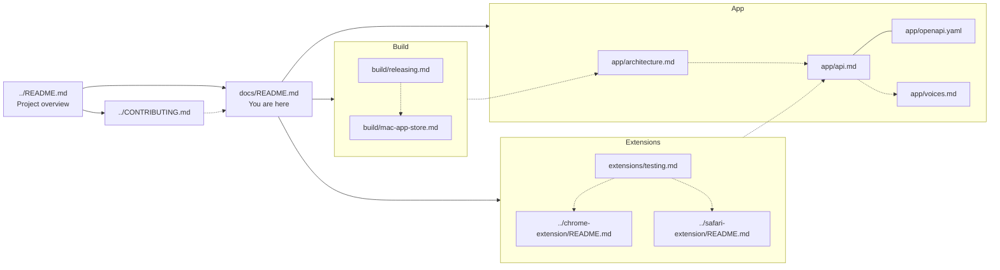

# Out Loud — documentation

Deeper docs for contributors and maintainers. For the user-facing overview (features, install, screenshots), start with the [root README](../README.md).

## Contents

- [Map](#map)
- [App](#app)
- [Extensions](#extensions)
- [Build and distribution](#build-and-distribution)
- [Contributing](#contributing)
- [Support](#support)
- [How the pieces fit](#how-the-pieces-fit)

## Map

```
docs/
├── app/            Electron app internals
│   ├── architecture.md      Processes, IPC, source tree, troubleshooting
│   ├── api.md               HTTP API reference with examples
│   ├── openapi.yaml         Machine-readable OpenAPI 3.1 spec
│   └── voices.md            Voice naming, language catalog, voice mixing
├── extensions/     Browser extension docs
│   └── testing.md           End-to-end testing across Chrome/Firefox/Safari
└── build/          Packaging and distribution
    ├── releasing.md         Cut a release via GitHub Actions
    └── mac-app-store.md     MAS signing, entitlements, TestFlight
```

## App

The Electron desktop app is the single source of truth — it owns the model, the worker thread, and the local HTTP server.

- **[`app/architecture.md`](./app/architecture.md)** — how the app is wired (main / renderer / worker), data flow, source tree, dev commands, troubleshooting
- **[`app/api.md`](./app/api.md)** — HTTP API with request / response examples
- **[`app/openapi.yaml`](./app/openapi.yaml)** — canonical OpenAPI 3.1 spec (also served live at `http://127.0.0.1:51730/api/v1/openapi.yaml`)
- **[`app/voices.md`](./app/voices.md)** — voice catalog, naming convention, voice-mixing formulas

## Extensions

The Chrome and Safari extensions are thin UI layers over the HTTP API.

- **[`extensions/testing.md`](./extensions/testing.md)** — smoke tests for Chrome, Firefox, Safari
- Per-package setup lives next to the code:
  - [`../chrome-extension/README.md`](../chrome-extension/README.md) — Chrome install + macOS auto-launch
  - [`../safari-extension/README.md`](../safari-extension/README.md) — Safari build via Xcode

## Build and distribution

- **[`build/releasing.md`](./build/releasing.md)** — cut a release via GitHub Actions (tag push → draft release with all platform artifacts attached)
- **[`build/mac-app-store.md`](./build/mac-app-store.md)** — MAS / TestFlight (certificates, entitlements, pipeline)
- Regular release packaging lives in [`../electron-builder.json`](../electron-builder.json) and the [root README](../README.md#build-from-source)

## Contributing

- [`../CONTRIBUTING.md`](../CONTRIBUTING.md) — dev setup, code style, PR checklist
- [`../.github/PULL_REQUEST_TEMPLATE.md`](../.github/PULL_REQUEST_TEMPLATE.md) — used automatically when opening a PR
- [`../.github/rulesets/`](../.github/rulesets/) — branch protection ruleset templates

## Support

Out Loud is free and open source. If it's useful to you, you can support its development:

<a href="https://buymeacoffee.com/julia_hk"></a>

[buymeacoffee.com/julia_hk](https://buymeacoffee.com/julia_hk)

## How the pieces fit


