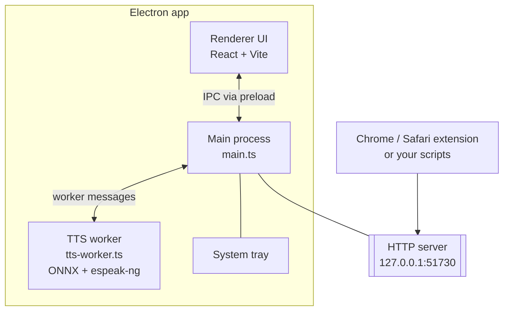
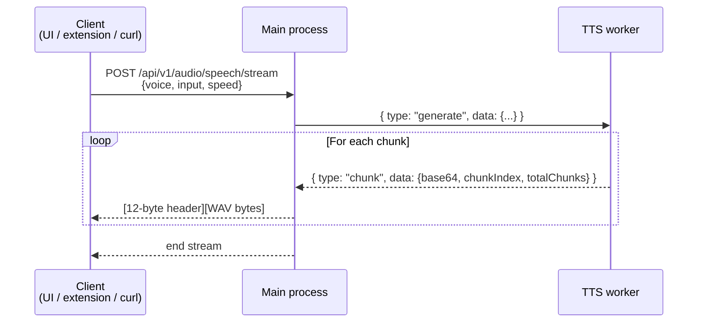

# App architecture

How the Out Loud Electron app is wired internally.

## Contents

- [Overview](#overview)
- [Processes and threads](#processes-and-threads)
- [Data flow](#data-flow)
- [Source tree](#source-tree)
- [Development commands](#development-commands)
- [Troubleshooting](#troubleshooting)

## Overview

The Electron app is the single source of truth for TTS. It owns:

- The ONNX model session (Kokoro-82M)
- espeak-ng for phonemization
- A local HTTP server on `127.0.0.1:51730` for the browser extensions and scripts

Nothing goes to the network. The HTTP server binds to loopback and rejects non-localhost requests.

## Processes and threads



**Main process** (`electron/main.ts`) — window, tray, HTTP server. Thin; forwards TTS requests to the worker.

**Renderer UI** (`electron-ui/`) — React + Vite. Never touches Node APIs directly; calls the main process via the `contextBridge` preload script (`electron/preload.ts`).

**TTS worker** (`electron/tts-worker.ts`) — separate thread. Owns the ONNX session and espeak-ng. Streams audio chunks back to the main process.

## Data flow



## Source tree

```
electron/
├── main.ts                Main process — window, tray, HTTP server
├── preload.ts             contextBridge API for the renderer
├── preload.cjs            CJS variant used by the packaged app
├── tts-worker.ts          ONNX session + espeak-ng phonemizer
├── shared-audio.ts        WAV helpers (creation, speed, MP3 encoding)
├── update-check.ts        Polls GitHub releases; surfaces update notices
├── store.ts               Persisted prefs (userData/preferences.json)
└── models/                Embedded ONNX model + voice bins

electron-ui/
├── src/
│   ├── App.tsx            Root component
│   ├── components/        UI widgets (voice select, sliders, About, etc.)
│   ├── hooks/             useAudioPlayer, useSettings, useUpdateCheck
│   ├── lib/               Small utilities (e.g. click feedback sound)
│   ├── constants.ts       Defaults
│   └── electron.d.ts      Types for window.electronAPI
└── vite.config.ts
```

## Development commands

See the [Scripts table](../../README.md#scripts) in the root README. Most common:

- `npm run electron:dev` — Electron + hot-reloaded UI
- `npm run electron:compile` — typecheck the main process
- `npm run electron:build` — package for the current platform

For Mac App Store / TestFlight distribution, see [`../build/mac-app-store.md`](../build/mac-app-store.md).

## Troubleshooting

### App won't start

- Check port `51730`: `lsof -i :51730`
- Quit existing instances in Activity Monitor / Task Manager

### No audio

- System volume not muted?
- Model finished loading (status shows **Ready**)?

### Slow first generation

First run loads the ONNX session into memory. Subsequent runs reuse the cached session.
