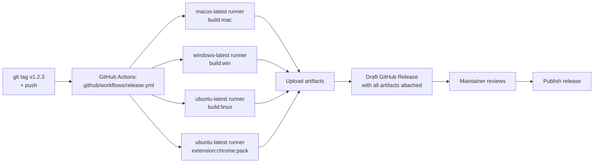

# Releasing

How to cut a new release. CI does the heavy lifting — you bump the version, tag it, push, and GitHub Actions builds + publishes a draft release.

## Contents

- [Output layout](#output-layout)
- [Release pipeline](#release-pipeline)
- [Cutting a release](#cutting-a-release)
- [Local builds (for verification)](#local-builds-for-verification)
- [Code signing](#code-signing)
- [Troubleshooting](#troubleshooting)
- [See also](#see-also)

## Output layout

All build artifacts land under `releases/` (gitignored):

```
releases/
├── macos/           *.dmg · *-mac.zip · *.blockmap
├── windows/         *-Setup.exe · *.blockmap
├── linux/           *.AppImage · *.deb · *.blockmap
└── extensions/
    ├── out-loud-chrome.zip
    └── safari/      Xcode project (generated from chrome-extension)
```

## Release pipeline



## Cutting a release

From a clean `main` branch, **one command does everything**:

```bash
npm run release 1.0.8        # or: patch / minor / major
```

[`scripts/release.mjs`](../../scripts/release.mjs) runs the whole pipeline end to
end — no other manual steps:

1. **Preflight** — verifies `gh` is authenticated and you're on a clean `main`
   that matches `origin`.
2. **Bump → PR → merge** — bumps the version on a `release-vX` branch, opens a
   PR, waits for CI to pass, and squash-merges it (satisfies branch protection).
3. **Tag** — tags the merged commit and pushes it, triggering the build.
4. **Build** — waits for the macOS/Windows/Linux build + draft release to finish.
5. **Notarize** — runs [`scripts/notarize-release.mjs`](../../scripts/notarize-release.mjs)
   on the macOS DMGs (submit → staple → re-upload in place) **while the release is
   still a draft**. This must happen before publish: GitHub's "Immutable releases"
   freezes a release's assets at publish time, so the stapled DMGs have to be in
   place first.
6. **Publish** — un-drafts the release, capturing the notarized assets.

Prerequisites: `gh` authenticated, the `out-loud-notary` keychain profile (see
[Code signing](#code-signing)), and — importantly — the tag ruleset must
**allow tag creation** by you. If the tag step fails with _"Cannot create ref
due to creations being restricted,"_ remove the **Restrict creations** rule on
`refs/tags/**` (or add yourself as a bypass actor) in the repo/org ruleset
settings. The script prints the exact recovery commands if this happens.

<details>
<summary>Manual fallback (if you ever need to run the steps by hand)</summary>

```bash
npm version patch --no-git-tag-version   # bump, then PR + merge it normally
git tag v1.0.8 && git push origin v1.0.8 # build → draft
gh run watch                             # wait for the build to finish
node scripts/notarize-release.mjs        # notarize the DMGs WHILE STILL A DRAFT
gh release edit v1.0.8 --repo light-cloud-com/out-loud --draft=false  # publish last
```

</details>

The tag push triggers [`.github/workflows/release.yml`](../../.github/workflows/release.yml), which:

1. Builds the macOS app on `macos-latest` — **signed but NOT notarized**. CI never blocks on Apple's notary queue, so this job consistently completes in ~5 min.
2. Builds the Windows installer on `windows-latest`
3. Builds the Linux AppImage + .deb on `ubuntu-latest`
4. Packs the Chrome extension on `ubuntu-latest`
5. Creates a **draft** GitHub Release with all artifacts attached

The notarize-release script (step 4) handles the Apple side locally — see the **Code signing** section for the rationale (Pattern C).

Draft releases aren't public — review the assets, run the notarize script, test the install, then click **Publish release** in the GitHub UI when ready.

### Manual trigger

If you need to re-run a release build without re-tagging:

```bash
gh workflow run release.yml -f tag=v1.0.1
```

## Local builds (for verification)

You can run any build locally. Outputs land in `releases/<platform>/`.

```bash
npm run electron:build:mac       # macOS .dmg + .zip (arm64 + x64)
npm run electron:build:win       # Windows .exe (from Windows host)
npm run electron:build:linux     # Linux .AppImage + .deb
npm run extension:chrome:pack    # Chrome extension zip
npm run extension:safari:convert # Safari Xcode project (macOS + Xcode)
```

Cross-platform caveats:

- **From macOS** — you can build mac natively. Windows/Linux cross-builds work with electron-builder's bundled tooling but can't properly sign.
- **From Linux/Windows** — can't build macOS (notarization requires Apple hardware).
- **CI does each platform on its native runner**, so all builds are proper.

## Code signing

Release builds are **Developer-ID signed on macOS** (using the cert pinned in `electron-builder.json` as `mac.identity`) and **unsigned on Windows**.

Notarization is intentionally **disabled in CI** (`mac.notarize: false`) and handled locally via `scripts/notarize-release.mjs` after CI finishes. This is **Pattern C** — see below for the rationale.

### Pattern C: CI signs, maintainer notarizes locally

We tried two earlier patterns and both broke under Apple's notary outages:

- **Pattern A (CI does everything inline)**: `notarytool submit --wait` runs inside the CI build job. The job times out (we cap at 45 min) when Apple's queue stalls — and during 1.0.2's release window, two submissions sat `In Progress` for 24+ hours. CI fails, you can't ship.
- **Pattern B (async with a watcher job)**: split into "submit" + "poll + staple" jobs orchestrated by `schedule:` triggers. Robust but adds real workflow complexity (state passing between jobs, artifact management, retry logic).

**Pattern C** keeps CI simple by removing the notarization step entirely from the build. CI ships signed-but-unnotarized DMGs to a draft release. The maintainer (you) then runs `node scripts/notarize-release.mjs` from any macOS terminal with the keychain credentials. That script:

1. Downloads each `.dmg` from the draft via `gh release download`
2. Submits to Apple with `xcrun notarytool submit --wait --timeout 2h`
3. On `Accepted`, staples the ticket with `xcrun stapler staple`
4. Verifies with `spctl --assess`
5. Re-uploads with `gh release upload --clobber`

Apple can take minutes or hours — it doesn't matter; the only thing waiting is your local terminal. The CI workflow has already long-since finished.

The script is idempotent: if a DMG is already stapled, it skips the submit step and just re-verifies. It also isolates per-DMG failures (one arch failing won't abort the others), retries the `stapler staple` step (Apple's ticket CDN can lag a few seconds behind `notarytool submit --wait`), and only re-uploads DMGs it successfully stapled. Safe to retry after partial failures.

> **Order matters with Immutable releases.** Run this script **while the release is still a draft**, then publish. GitHub freezes a release's assets the moment it's published (un-drafted) and that immutability is **permanent** — it can't be undone by toggling the repo setting later, so a published release's unnotarized DMGs can never be replaced. `release.mjs` enforces this order automatically.

Prerequisite: store credentials in your Keychain once.

```bash
xcrun notarytool store-credentials "out-loud-notary" \
  --apple-id "<your-apple-id>" \
  --team-id "<TEAM_ID>"
```

### macOS first-launch UX

| Build state                                                                     | What users see on first launch                                                                                                                      |
| ------------------------------------------------------------------------------- | --------------------------------------------------------------------------------------------------------------------------------------------------- |
| Developer-ID signed AND notarized (after running `notarize-release.mjs`)        | App opens immediately, no dialog.                                                                                                                   |
| Developer-ID signed, NOT notarized (raw CI output, or if you skip notarization) | "macOS cannot verify the developer of Out Loud." Right-click → Open (macOS 14-), or System Settings → Privacy & Security → Open Anyway (macOS 15+). |

End-user instructions for the second case live in the [main README](../../README.md#macos-first-launch).

### macOS: required secrets and env vars

CI signs but doesn't notarize, so it only needs the signing pair. These should be set as GitHub repository secrets:

| Secret             | Used by | Source                            |
| ------------------ | ------- | --------------------------------- |
| `CSC_LINK`         | CI      | Base64-encoded `.p12` certificate |
| `CSC_KEY_PASSWORD` | CI      | Password for the `.p12`           |

The notarize-release script runs locally and uses the Keychain profile (`out-loud-notary`) you set up with `xcrun notarytool store-credentials`. No env vars needed for the script.

If you want to put `APPLE_ID` / `APPLE_TEAM_ID` / `APPLE_APP_SPECIFIC_PASSWORD` into GitHub secrets too — say you ever decide to move back to Pattern A — they're consumed by `release.yml`'s env block but only activate notarization when `mac.notarize` is `true` in `electron-builder.json`. Today they're effectively unused.

For Mac App Store (not Developer ID direct distribution), see [`mac-app-store.md`](./mac-app-store.md).

### Windows

| Secret                 | Source                            |
| ---------------------- | --------------------------------- |
| `WIN_CSC_LINK`         | Base64-encoded `.pfx` certificate |
| `WIN_CSC_KEY_PASSWORD` | Password for the `.pfx`           |

Without these, the Windows installer ships unsigned and SmartScreen prompts users to confirm on first run.

### Linux

No signing required for AppImage or .deb.

## Troubleshooting

### "No artifacts uploaded"

One of the platform builds failed. Check the workflow logs — the release job runs regardless so successful artifacts still attach.

### "Release already exists"

Either the tag was published previously, or a previous run already created it. Delete the existing draft in GitHub UI, or publish/delete it, then re-run.

### Local mac build fails with "requires macOS"

`electron:build:mac` must run on macOS. On other platforms, rely on CI.

### Linux build missing `.deb`

Ensure `dpkg` is available (it is on `ubuntu-latest`). Locally on macOS, `.AppImage` builds but `.deb` requires `dpkg` (install with `brew install dpkg`).

## See also

- [`../../README.md#build-from-source`](../../README.md#build-from-source) — local build commands
- [`../../electron-builder.json`](../../electron-builder.json) — packaging config
- [`mac-app-store.md`](./mac-app-store.md) — MAS-specific flow (different from direct distribution)
